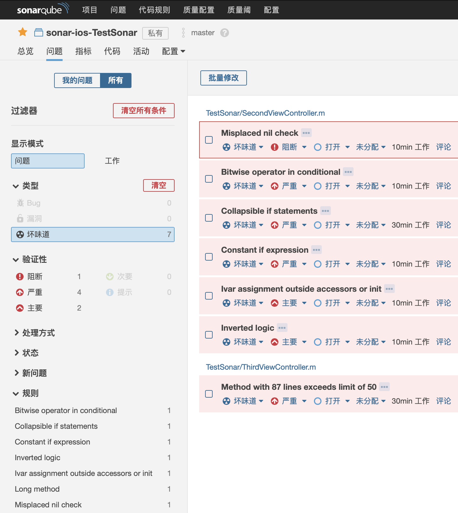

## sonar的功能演示和代码规则

### 基本功能

- 项目代码扫描结果的问题页面




### 代码规则

- Misplaced nil check：解读：判断空，放错位置了。
```swift

//    Misplaced nil check
    NSString *verifyStatus = [[NSUserDefaults standardUserDefaults] 
    objectForKey:@"verifyStatus"];
    //  不推荐示例：
    if ([verifyStatus isEqualToString:@""] || !verifyStatus) {
        NSLog(@"if verifyStatus true");
    } else {
        NSLog(@"if verifyStatus false");
    }
    //  推荐示例：
    BOOL isNil = (verifyStatus == nil);
    BOOL isEmpty = [verifyStatus isEqualToString:@""];
    BOOL result = (isNil || isEmpty);
    if (result == true) {
        NSLog(@"if verifyStatus true");
    } else {
        NSLog(@"if verifyStatus false");
    }
```


- Long Method：
一个方法，超过50行

- High ncss（non-commenting source statements） method：
一个方法，超过30行，没有注释

- Empty if statement：
if语句内是空的

- Empty else block：
else语句内是空的

- Bitwise operator in conditional：
在条件语句中，使用了位运算
```swift
//    Bitwise operator in conditional
    NSInteger zero = 0;
    NSInteger one = 1;
    //  不推荐示例：
    if (zero & one) {
        NSLog(@"同真为真");
    } else {
        NSLog(@"其他为假");
    }
    //  推荐示例：
    BOOL result2 = zero & one;//位运算符号：与：&，或：^，非：!
    if (result2) {
        NSLog(@"同真为真");
    } else {
        NSLog(@"其他为假");
    }
```

- Deep nested block：
判断深度超过5层

- Collapsible if statements：
如果多层判断，可以合并成一层
```swift
//    Collapsible if statements
    NSString *str1 = @"dcj";
    NSString *str2 = @"lpj";
   //  不推荐示例：
    if ([str1 isEqualToString:@"dcj"]) {
        if ([str2 isEqualToString:@"lpj"]) {
            // 双层判断，可以合并为一层
            NSLog(@"isEqualToString true");
        }
    }
    //  推荐示例：
    BOOL isE = [str1 isEqualToString:@"dcj"] && [str2 isEqualToString:@"lpj"];
    if (isE) {
        NSLog(@"isEqualToString true");
    } else {
        NSLog(@"isEqualToString false");
    }
```

- Too many methods：
一个类里，方法数量超过30

- Too many parameters：
一个方法携带的形参，超过10个

- Long class：
一个源文件里，代码超过1000行

- Dead code：
当方法内，代码里有return，并且后面的代码永远不会被执行时。
```swift
    return;
    NSLog(@"code will never be excuted");
```

- Constant if expression：
在if语句，判断一个常量。
```swift
//    Constant if expression
    #define isViPOS 0
    //  不推荐示例：
    if (isViPOS == 1)  {
        NSLog(@"define constaint isViPOS true");
    } else {
        NSLog(@"define constaint isViPOS false");
    }
    //  推荐示例：
    BOOL result3 = (isViPOS == 1);
    if (result3)  {
        NSLog(@"define constaint isViPOS true");
    } else {
        NSLog(@"define constaint isViPOS false");
    }
```

- constant conditional operator：
在条件语句中，只用了常量。同上

- Empty finally statement：
@finally {
//代码块儿里不能空
}

- Broken oddness check：
```swift
//    Broken oddness check
    NSUInteger someInt = 3;
    //  不推荐示例：
    if (someInt%2 ==1 ) {
        NSLog(@"奇数");
    } else {
        NSLog(@"偶数");
    }
    //  推荐示例：
    if (someInt % 2 == 1) {
        NSLog(@"奇数");
    } else {
        NSLog(@"偶数");
    }
```

- Short variable name：
变量名称，长度不能小于3

- Ivar assignment outside accessors or init：
```swift
//    Ivar assignment outside accessors or init
    //  不推荐示例：
    _someStr = @"someStr";
    //  推荐示例：
    self.someStr = @"someStr";
```

- Long variable name：
长度大于20

- High cyclomatic complexity：
一个方法内，里面if判断超过10个

- High npath complexity：
一个方法，内部的执行深度大于200。就是写的逻辑太多了，太复杂了。

- Prefer early exits and continue：
使用早点退出，简化代码并减少缩进
```swift
- (instancetype)init
{
    self = [super init];
    //  不推荐示例：
    if (self) {
        _someName = @"someName";
        _someName2 = @"someName2";
        _someName3 = @"someName3";
    }
    //  推荐示例：
    if (self == nil) {
        return self;
    }
    _someName = @"someName";
    _someName2 = @"someName2";
    _someName3 = @"someName3";
    return self;
}
```

- Parameter reassignment：
一个方法的实参，在方法内部，不能在被赋值。

- Inverted logic：
建议使用正向逻辑
```swift
//  不推荐示例：    
    if (_someStr != nil) {
        NSLog(@"反向逻辑判断 true");
    } else {
        NSLog(@"反向逻辑判断 false");
    }
    //  推荐示例：
    if (self.someStr == nil) {
        NSLog(@"正向逻辑判断 true");
    } else {
        NSLog(@"正向逻辑判断 false");
    }
```

- Missing default in switch statements：
当没有穷举switch的case时，要加上default:语句

- Too few branches in switch statement：
出现在当列举的case太少时。这时建议改成ifelse语句

- Unnecessary default statement in covered switch statement：
当穷举完所有的case时，不用写default:语句了

- Missing break in switch statement：
在case语句，丢失了break；

- Avoid branching statement as last in loop：
在for循环中，不要使用break和return；
```swift
for (CLLockItemView *itemViewSub in self.subviews) {
    if(!CGRectContainsPoint(itemViewSub.frame, loc)) continue;
    itemView = itemViewSub;
    break;
}
```

### Demo
https://github.com/dengchaojie/demos/tree/master/Lib/TestSonar/TestSonar

### 参考
https://rules.sonarsource.com/objective-c/type/Code%20Smell


